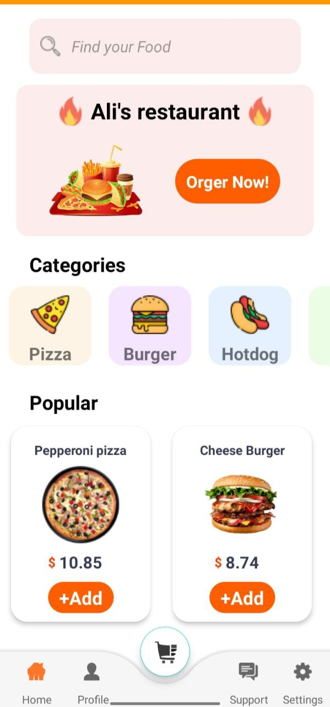
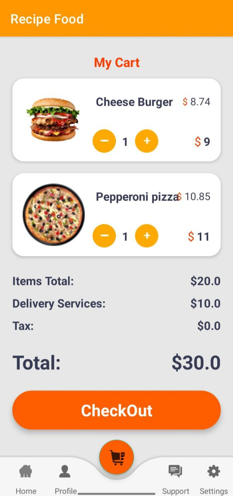

  <h1>E-Commerce App</h1>
  
The E-Commerce App is a comprehensive solution for online shopping, offering users a smooth interface to browse and purchase products. It supports adding items to the shopping cart and facilitates easy checkout processes.

  
  <h2>Key Features</h2>
  <ul>
    <li>Seamless product browsing experience</li>
    <li>Easy addition of products to the shopping cart</li>
    <li>Simplified purchase completion</li>
  </ul>
  
  <h2>Technologies Used</h2>
  
This app is developed with Kotlin and leverages the MVVM (Model-View-ViewModel) architecture for a clean, testable, and maintainable codebase. Retrofit handles network requests efficiently, while Firebase provides a real-time backend service. Glide is used for image loading, and the Repository Pattern ensures a clean separation of data sources. LiveData observes data changes, Databinding binds UI components in your layouts to data sources, Room offers robust database support, Hilt provides dependency injection, and RxJava handles asynchronous and event-based programming.

  
  <h3>MVVM</h3>
  
MVVM stands for Model-View-ViewModel. It separates the user interface logic from the business logic, with the ViewModel acting as an intermediary that handles most of the view's logic. The ViewModel works with the Model to get and store the data, and signals the View when the data changes.

  
  <h3>LiveData</h3>
  
LiveData is a data holder class that can be observed within a given lifecycle. It respects the lifecycle of other app components, such as activities and fragments, meaning it only updates component observers that are in an active lifecycle state.

  
  <h3>Room</h3>
  
Room is a persistence library that provides an abstraction layer over SQLite. It simplifies database work and allows for fluent database access while harnessing the full power of SQLite.

  
  <h3>Retrofit</h3>
  
Retrofit is a type-safe HTTP client for Android and Java. It makes it relatively easy to retrieve and upload JSON (or other structured data) via a REST-based webservice.

  
  <h3>Firebase</h3>
  
Firebase is a platform developed by Google for creating mobile and web applications. It provides tools for tracking analytics, reporting and fixing app crashes, creating marketing and product experiment.

  
  <h3>Glide</h3>
  
Glide is an image loading library for Android that's great at providing smooth, efficient image loading with minimal code.

  
  <h3>Repository Pattern</h3>
  
The Repository Pattern abstracts the data layer, providing a clean API for data access to the rest of the application.

  
  <h3>Databinding</h3>
  
Databinding binds UI components in your XML layouts to data sources using a declarative format rather than programmatically.

  
  <h3>Hilt</h3>
  
Hilt is a dependency injection library for Android that reduces the boilerplate of doing manual dependency injection in your project.

  
  <h3>RxJava</h3>
  
RxJava is a Java VM implementation of Reactive Extensions: a library for composing asynchronous and event-based programs by using observable sequences.

    <h2 class="video-title">The Application</h2>

  
  
  
  

